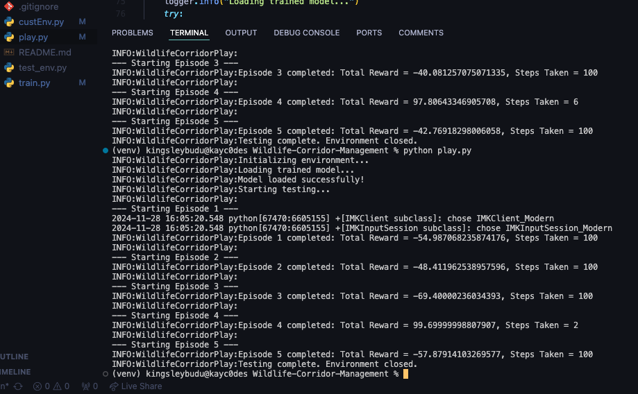

# Wildlife-Corridor-Management
The goal is to ensure safe passage of animals (represented by the agent) while avoiding human settlements, poaching zones, and natural obstacles like rivers or cliffs.

## Project Structure

The project consists of three main files:

1. **custEnv.py**: Contains the custom environment implementation.
2. **train.py**: Script for training a reinforcement learning agent using the Deep Q-Network (DQN) algorithm.
3. **play.py**: Script for testing the trained model in the environment.

## Environment Overview

|   | 0  | 1  | 2  | 3  | 4  | 5  | 6  | 7  | 8  | 9  |
|---|----|----|----|----|----|----|----|----|----|----|
| 0 | **A** |    |    |    |    |    |    |    |    |    |
| 1 |      |    |    |    |    |    |    |    |    |    |
| 2 |      |    | **X** | **X** | **X** |    |    |    |    |    |
| 3 |      |    |    |    |    |    |    |    |    |    |
| 4 |      |    |    |    |    |    |    |    |    |    |
| 5 |      |    |    |    |    | **X** | **X** | **X** |    |    |
| 6 |      |    |    |    |    |    |    |    |    |    |
| 7 |      |    | **X** |    |    |    |    |    |    |    |
| 8 |      |    | **X** | **X** |    |    |    |    |    |    |
| 9 |      |    |    |    |    |    |    |    |    | **G** |

The custom environment simulates a wildlife corridor with the following components:

- **Grid Layout**: A grid of size `10x10` (modifiable) where the agent moves.
- **Agent**: The agent that navigates the grid to reach a goal while avoiding obstacles.
- **Obstacles**: Predefined obstacles scattered throughout the grid.
- **Goal**: The target location that the agent must reach.
- **Themes**: The environment can have different themes (`forest`, `desert`, `water`), each affecting movement and rewards:
  - **Forest**: The agent receives a small penalty for each step and a large reward for reaching the goal.
  - **Desert**: Higher penalties for movement and smaller rewards.
  - **Water**: The highest movement penalty and lower rewards.
  
### Key Features of the Environment

- **Randomized Start and Goal**: Start and goal positions can be randomized or fixed.
- **Step Limit**: The environment terminates an episode after a fixed number of steps.
- **Visualization**: The environment renders a grid using OpenCV, displaying the agent, obstacles, and the goal.

## Dependencies

This project requires the following libraries:

- **gymnasium**: For creating the custom environment and using RL algorithms.
- **stable-baselines3**: For training the DQN agent.
- **opencv-python**: For rendering the environment visually.

You can install the required libraries using:

```bash
pip install gymnasium stable-baselines3 opencv-python
```

## Getting Started

1. Clone this repository
    ```bash
    git clone https://github.com/kayc0des/Wildlife-Corridor-Management
    ```
2. cd into the working directory
    ```bash
    cd wildlife-corridor-management
    ```
3. Create a virtual environment
    ```bash
    python -m venv <envName>
    source <envName>/bin/activate
    ```
4. Install the necessary requirements
    ```bash
    pip install -r requirements.txt
    ```
5. Run scripts as shown below

### Training the Agent

To train the agent using the DQN algorithm, run the train.py script. This script initializes the environment, sets up a reinforcement learning agent, and trains it over multiple episodes.

```bash
python3 train.py
```

### Testing the Model

After training the agent, you can test its performance using the play.py script. The script will load the trained model and run it in the environment for a specified number of episodes.

```bash
python3 play.py
```

### Model Saving and Checkpointing

During training, the model is saved periodically using CheckpointCallback, and the best model is also saved using EvalCallback. The final trained model is saved to the models directory.

    - Models are saved under the models/ directory, and the best model is saved under models/best_model/.

## Environment Details

### Action Space
The agent can take one of the following actions:
- `0`: Move Up
- `1`: Move Right
- `2`: Move Down
- `3`: Move Left

### Observation Space
The environment provides a 3D grid observation with the following shape: (grid_size, grid_size, 3)

For example, a 10x10 grid will have the shape `(10, 10, 3)`.

**Layers:**
- **Agent Layer**: `1` at the agent's current position.
- **Obstacles Layer**: `1` where obstacles are located.
- **Goal Layer**: `1` at the goal's location.

### Rewards
The agent receives rewards and penalties based on its movement and theme:
- **Reaching the Goal**: High reward (100 points).
- **Exceeding Maximum Steps**: Penalty (-10 points).
- **Distance to the Goal**: A small penalty based on proximity.
  
**Theme-based penalties:**
- **Forest**: Small penalty (0.2).
- **Desert**: Larger penalty (0.5).
- **Water**: Largest penalty (1.0).

## Visualization

The environment is rendered visually using OpenCV. The agent, obstacles, and goal are displayed with distinct colors, and the environment is shown in a grid format. The grid cells are color-coded according to the environment theme (e.g., forest green, desert sand, water blue).

### Terminal output



## Conclusion

During the testing phase with play.py, although the agent experienced oscillations in its movements, it successfully reached the goal in some episodes - Like in `episodes 4 of the terminal output above`. This indicates that while the agent's performance may need further refinement, the model has learned some successful strategies for navigating the environment and achieving the goal. With additional training or fine-tuning, the agent's behavior could be improved to handle more complex scenarios and achieve more consistent results.